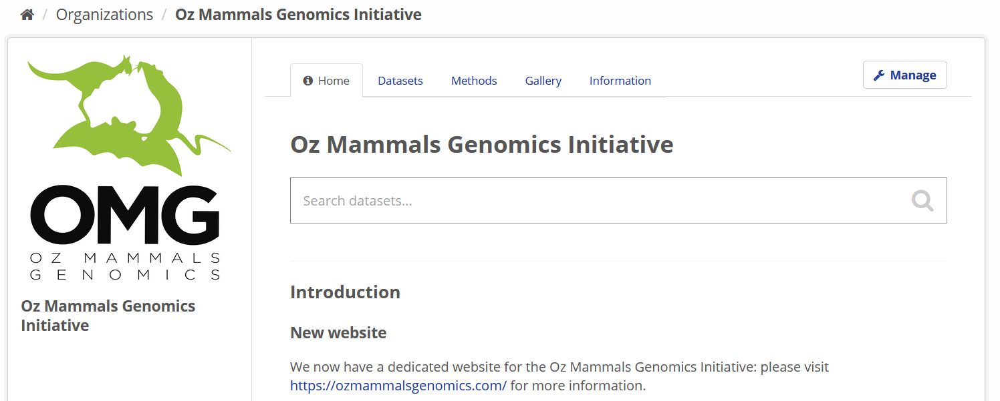
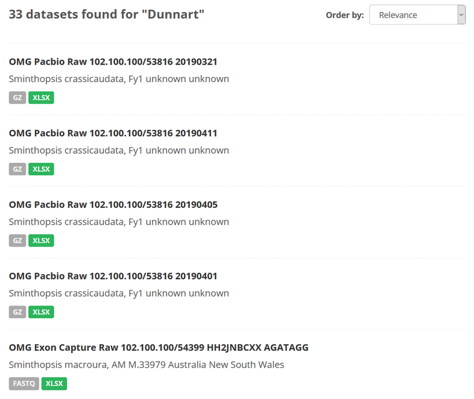
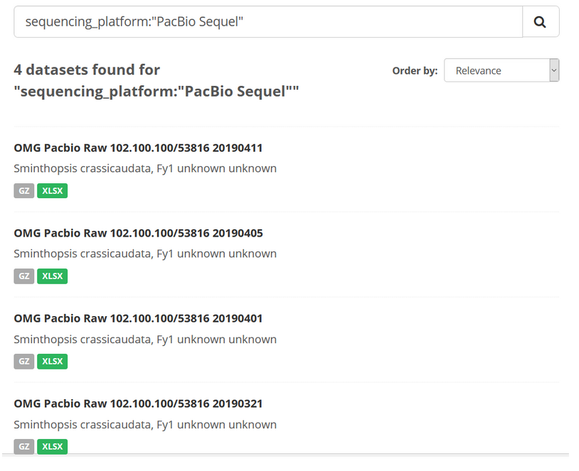

## Introduction

The instructions here provide clarity regarding how to effectively search the Bioplatforms data portal, and obtain search results that are either specific to a certain meta-data field (e.g. `flowcell_id`), or which can capture the existence of search values across meta-data fields.

When you have found the data set(s) you were looking for, it's time to [download](programmatic_access.md). 

## Search box

The query terms for any search should be entered into the "Search" box, which appears on the landing pages for each Framework Initiative on the data portal.

The proper syntax for a data portal search is `[meta-data field name]:[value]`. Examples are provided in each of the sections below.

**Note**: there are two search modes that can be used for the data portal.

1. **Simple**: no colon is used, simply enter the search words
2. **Advanced**: at least one colon present, with numerous options possible including boolean operators (`AND` / `OR` / `NOT` / `+` / `-` )

## Meta-data fields available for search

For the Oz Mammals Genomics example above, some common meta-data fields that may be of interest are:

- `bpa_dataset_id`: Bioplatforms Australia dataset ID for this sequencing run
- `bpa_library_id`: Bioplatforms Australia library ID for this library prep
- `bpa_sample_id`: unique identifier from Bioplatforms Australia, assigned to the material sample
- `class`: the full scientific name of the class in which the taxon is classified
- `common_name`: common name of the species
- `data_type`
- `family`: the full scientific name of the family in which the taxon is classified
- `order`: the full scientific name of the order in which the taxon is classified
- `phylum`: the full scientific name of the phylum in which the taxon is classified
- `genus`: the full scientific name of the genus in which the taxon is classified
- `species`: the name of the first or species epithet of the scientific name
- `subspecies`: if relevant, the name of the lowest or terminal infraspecific epithet of the scientific name, excluding any rank designation, e.g. subspecies
- `library_type`: type of library prepared (exon, capture, ddRAD etc.)
- `life_stage`: the age class or life stage of the animal at the time of sampling
- `omg_project`: name of OMG project this work relates to (e.g. Phylogenomics)
- `sequencing_facility`: name of the sequencing facility
- `sequencing_platform`: name of sequencing platform used
- `sex`: the sex of the animal
- `tissue_type`: the type of tissue or substance sampled

**Note**: many more fields are in active use at any one time and these will vary slightly for each Framework Initiative. You can find a list of these fields by clicking on a relevant dataset and scrolling down to the ‘Additional Info’ table. 

## Simple search

To conduct a broad search, simply type a keyword into the search bar. This type of search will look for that keyword anywhere in the database and is more suited for initial discovery searches to gain an appreciation for the resources available through any one Framework Initiative.

For example, if you search the OMG section of the portal for data sets using the keyword "Dunnart", the following occurs:

- 33 data sets were discoverable (2020-10-14)
- These are split across multiple `data_types` and `omg_project` values

## Advanced search for specific meta-data fields

If the values of interest are known, it is better to search for specific values (e.g. “Fat-tailed Dunnart”) in a single defined meta-data field (e.g. `common_name`).

The format for this is `field:[”value”]`

For example, if you wanted to search for all data sets that were produced using a specific `sequencing_platform` making use of the accepted Bioplatforms sequencing platform ontology (e.g. searching for "PacBio Sequel"), your search syntax would look like this:

    sequencing_platform:"PacBio Sequel"

**Note**: make sure you include the apostrophes!

Here, 4 data sets are located, each of which used the PacBio Sequel instrument as the `sequencing_platform`.

## Advanced search across multiple meta-data fields

If you wanted to search across multiple meta-data fields, and each search term was mandatory / required, the search syntax would look like this:

    [meta-data field name]:[value] AND [meta-data field name]:[value]

For example, to identify a specific combination of genus and species:

    genus:Sminthopsis AND species:crassicaudata

This is useful as it distinguishes datasets for the genus Sminthopsis, for which there are 5 species available, including:

- *Sminthopsis dolichura*,
- *Sminthopsis gilberti*,
- *Sminthopsis granulipes*,
- *Sminthopsis longicaudata*, in addition to
- *Sminthopsis crassicaudata*

## Acknowledgements

Source material for [CKAN search instructions](https://gist.github.com/davidmiller/f22c2dcb347f3dbc4b16cb8a4bddbc04)

