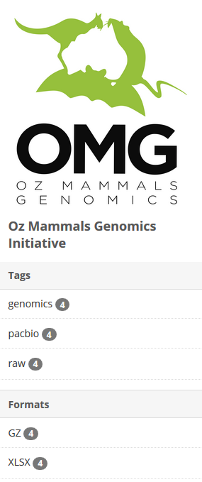

## **Find, filter and download Framework Initiative data**

### Context

This guide is intended to capture download to a desktop workstation. Please note, the `download.sh` file described in step 12 below can be used for direct download of portal data to a high performance computing (HPC) environment.

### Instructions

1. Go to the Data portal page
2. Log-in using your username and password (created during [registration](registration_login.md))
     - Login is required for full functionality including access to datasets
3. Select the banner or text link for the Framework Initiative of interest: e.g. [Oz Mammals Genomics](https://ozmammalsgenomics.com/)


4. Use the `Search datasets…` field  textbox to search for the data you want (e.g. PacBio Dunnart)

<p align="center">

</p>

5. To narrow search results further, use the Tags in the left column, which will filter the data (see image below)

<p align="center">

</p>
     
6. When you have the files you want on the search page, click bulk download

<p align="center">

</p>
     
   - This will generate a zip folder with the files you need to download the data
   - Download and decompress this folder
   - Inside there are the following files and folders:
       - `package_metadata/`
       - `resource_metadata/`
       - `tmp/`
       - `download.ps1`
       - `download.sh`
       - `README.txt`

7. `README.txt` provides instructions for data download: **PLEASE READ THIS!**
8. `package_metadata` contains a spreadsheet file with the metadata relevant to the downloaded filtered data set
9. `resource_metada` contains a spreadsheet file with the metadata relevant to the files which comprise the filtered data set
10. The `tmp/` folder contains:

- `*_md5sum.txt`, where the * indicates the name of the downloaded data package
- `*_urls.txt`, where the * indicates the urls for each data set in the downloaded package

11. `download.ps1` and `download.sh` are shell scripts 
   
- `download.ps1`: Windows PowerShell script (see below), which when executed will download the files, and then checksum them. This is supported on a Microsoft system, and uses only PowerShell.

```
#!/usr/bin/env pwsh

$apikey = $Env:CKAN_API_KEY
if (!$apikey) {
  'Please set the CKAN_API_KEY environment variable.'
  ''
  'You can find your API Key by browsing to:'
  'https://data.bioplatforms.com//user/[USERNAME]'
  ''
  'The API key has the format:'
  'xxxxxxxx-xxxx-xxxx-xxxx-xxxxxxxxxxxx'
  ''
  'To set the environment variable in Linux/MacOS/Unix, use:'
  'export CKAN_API_KEY=xxxxxxxx-xxxx-xxxx-xxxx-xxxxxxxxxxxx'
  ''
  'On Microsoft Windows, within Powershell, use:'
  '$env:CKAN_API_KEY=xxxxxxxx-xxxx-xxxx-xxxx-xxxxxxxxxxxx'
  exit 1
}

#
# This PowerShell script was automatically generated.
#

function DownloadURL($url)
{
    $filename = $url.Substring($url.lastIndexOf('/') + 1)
    if (Test-Path $filename) {
        "File already exists, skipping download: " + $filename
        return
    }
    $client = new-object System.Net.WebClient
    if ($apikey) {
        $client.Headers.Add('Authorization: ' + $apikey)
    }
    "Downloading: " + $filename
    $client.DownloadFile($url, $filename)
}

function VerifyMD5([String]$filename, [String]$expected_md5)
{
    $md5hash = new-object -TypeName System.Security.Cryptography.MD5CryptoServiceProvider
    try {
        $actual_md5 = [System.BitConverter]::ToString($md5hash.ComputeHash([System.IO.File]::ReadAllBytes($filename))).Replace('-', '').toLower();
    } catch [System.IO.FileNotFoundException] {
        $filename + ": FAILED open or read"
        return
    }
    if ($actual_md5 -eq $expected_md5) {
        $filename + ": OK"
    } else {
        $filename + ": FAILED"
    }
}

'Commencing bulk download of data from CKAN:'
''

$urls = Get-Content 'tmp/[DATA PACKAGE NAME]_urls.txt'
ForEach ($line in $urls) {
    DownloadURL $line
}

'File downloads complete.'
''
'Verifying file checksums:'
''
$md5s = Get-Content 'tmp/[DATA PACKAGE NAME]_md5sum.txt'
ForEach ($line in $md5s) {
    $md5, $filename = $line.Split(" ",[StringSplitOptions]'RemoveEmptyEntries')
    VerifyMD5 $filename $md5
}
```

   - `download.sh`: UNIX shell script (see below), which when executed will download the files, and then checksum them. This is supported on any Linux or MacOS/BSD system, so long as `curl` is installed.
 
 ```
#!/bin/sh

#
# This UNIX shell script was automatically generated.
#

if [ x"$CKAN_API_KEY" = "x" ]; then
  echo "Please set the CKAN_API_KEY environment variable."
  echo
  echo "You can find your API Key by browsing to:"
  echo "https://data.bioplatforms.com//user/[USERNAME]"
  echo
  echo "The API key has the format:"
  echo "xxxxxxxx-xxxx-xxxx-xxxx-xxxxxxxxxxxx"
  echo
  echo "To set the environment variable in Linux/MacOS/Unix, use:"
  echo "export CKAN_API_KEY=xxxxxxxx-xxxx-xxxx-xxxx-xxxxxxxxxxxx"
  echo ""
  exit 1
fi


if ! which curl >/dev/null 2>&1; then
  echo "`curl` is not installed. Please install it."
  echo
  echo "On MacOS, it can be installed via HomeBrew (https://brew.sh/)"
  echo "using the command `brew install curl`"
  exit 1
fi

echo "Downloading data"
while read URL; do
    echo "Downloading: $URL"
    curl -O -L -C - -H "Authorization: $CKAN_API_KEY" "$URL"
done < tmp/[DATA PACKAGE NAME]_urls.txt

echo "Data download complete. Verifying checksums:"
md5sum -c tmp/[DATA PACKAGE NAME]_md5sum.txt 2>&1 | tee tmp/md5sum.log
```

12. When you run `download.sh` or `download.ps1`, it will provide instructions to set up your API key
13. Set up API key
14. Run `downloads.sh` or `downloads.ps1` again
15. The data should now download and checksum
