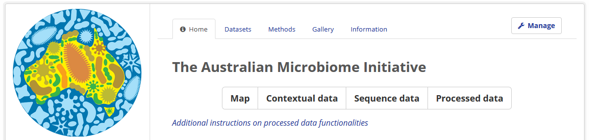
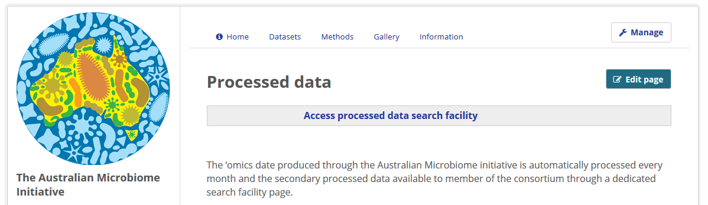
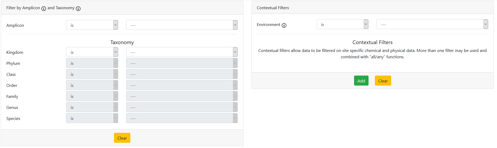
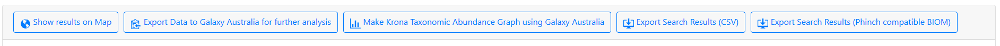

## **Filter by meta-data ([Australian Microbiome](https://www.australianmicrobiome.com/))**

Note: the processed data facility instructions can be accessed [here](https://data.bioplatforms.com/organization/pages/australian-microbiome/processed). This text has been incorporated below.

1. Go to the [Data portal page](https://data.bioplatforms.com/) 
2. Log-in using your username and password (created during registration)
3. Select the banner or text link for the Framework Initiative of interest: e.g. [Australian Microbiome](https://www.australianmicrobiome.com/)
4. In the "Home" tab for the Initiative, click [Additional instructions on processed data functionalities](https://data.bioplatforms.com/organization/pages/australian-microbiome/processed)



5. On the [Processed data](https://data.bioplatforms.com/organization/pages/australian-microbiome/processed) page, click the [Access processed data search facility](https://data.bioplatforms.com/bpa/otu/) link



6. Apply filters to reduce to your dataset(s) of interest
     - Filters of the different categories can be combined
     - Filters available:
          - Amplicon type     
               - All
               - Bacteria / 16SrRNA (27f / 591r) 
               - Archaea / 16SrRNA (A2f / 519r)
               - Fungi / ITS1 (ITS1F / ITS4) - Soil only
               - Fungi / ITS2 (ITS1F / ITS4) - Soil only
               - Eukaryota / 18SrRNA (1391f / EukBr) - Soil only
               - Eukaryota / 18SrRNA (18Sv4F / 18Sv4R) – Marine only
               - Metaxa (bacterial 16SrRNA derived from metagenomes)
          - Taxonomy (hierarchical, taxonomic selection auto-populate lower taxonomic search terms)
          - Contextual     
               - Environment (all; marine; soil)
               - Additional search filters through range or text selection. Single or multiple filters can be applied with the option of matching “all” (every filter need to be true) or “any” (either filter need to be true)         
                    - Contextual metadata category (e.g. date sampled; depth; chlorophyll a)
                    - Sample ID (single or range selection)
                    - Sample type (all; coastal water; coral; pelagic; seaweed; sediment; soil; sponge)



```
Taxonomy search example

Search needs: bacteria, classified at phylum level

Selection

- amplicon = 27f519r_bacteria
- domain = Bacteria
- phylum ≠ unclassified

Result

16S abundance table for all samples containing bacteria classified at the phylum level (removed samples: samples without classified bacterial phyla and all non-bacterial and non-classified phylum OTU)
the associated metadata for samples contained in the abundance table
```

7. The "Show results on Map" link will open a heatmap view of the samples filtered. The default initial view contains the full dataset.



8. Zoom in/out using the +/- buttons or by “right clicking” on the collection site
     - In case of multiple samples mapped a number will indicate how many sites are represented with a gradient colour (red for high numbers to green for low numbers)
     - Sample ID and coordinates can be viewed for single sites by “right clicking” on the map site marker
9. Export - the initial default page contains the full dataset. If no filters are selected, the export search result will initiate the download for the full analysed dataset from Australian Microbiome
     - If filters are applied, the export will download only the filtered resulting samples
