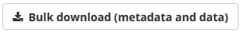
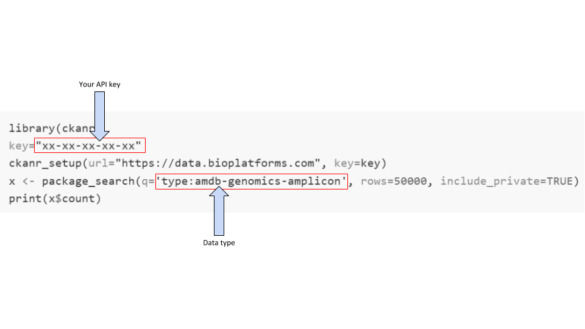

## Download via HPC (bulk download)

### Context

This guide is intended to capture download to a desktop workstation, or direct download of portal data to a high performance computing (HPC) environment.

### Instructions

1. When you have found the data set(s) you would like to download, click bulk download

   <p align="center">
   
   </p>
     
   - This will provide a summary of the processs, and present a Download Zip button. Clicking this button will generate a zip folder with the files you need to download the data
   - Download and decompress this folder
   - Inside there are the following files and folders:
       - `organization_metadata/`
       - `package_metadata/`
       - `resource_metadata/`
       - `tmp/`
       - `download.py`
       - `download.ps1`
       - `download.sh`
       - `README.txt`

2. `README.txt` provides instructions for data download, and information about the size of the data you have selected for download: **PLEASE READ THIS!**

3. `organization_metadata` contains a spreadsheet file for each organization which owns data in the downloaded filtered data set. This metadata includes links to acknowledgement, initiative and methods information.

4. `package_metadata` contains a spreadsheet file with the metadata relevant to the downloaded filtered data set

5. `resource_metada` contains a spreadsheet file with the metadata relevant to the files which comprise the filtered data set

6. The `tmp/` folder contains:

   - `*_md5sum.txt`, where the * indicates the name of the downloaded data package
   - `*_urls.txt`, where the * indicates the urls for each data set in the downloaded package

7. `download.py`, `download.ps1` and `download.sh` are scripts in Python, Powershell and bash
   
   - `download.py`: Python 3 script, which when executed will download the files, and then checksum them. This is supported on all platforms (Windows, Linux, MacOS).  Requires Python 3 and the `requests` module to be installed.

   - `download.ps1`: Windows PowerShell script, which when executed will download the files, and then checksum them. This is supported on a Microsoft system, and uses only PowerShell.

   - `download.sh`: UNIX shell script,  which when executed will download the files, and then checksum them. This is supported on any Linux or MacOS/BSD system, so long as `curl` is installed.
 
8. When you run `download.py`, `download.sh` or `download.ps1`, it will provide instructions to set up your API key
9. Set up API key
10. Ensure you have sufficient storage available for your selected data to download. Size requirements can be viewed in README.txt.
11. Run `download.py`, `download.sh` or `download.ps1` again
12. The data should now download and checksum

### Common Issues and Problems

#### download.sh - MD5 sums do not validate correctly and files are not correct size

* Check that you are running a recent version of curl.   The Bioplatforms Data Portal requires version 7.58 or later
  (due to a bug fix with the Authorization header).  Run `curl --version` to check.
* Check that your PATH contains the correct version of curl.  Run `which curl` to check.


---

## Programmatic Download via R/Python/bash

The Bioplatforms Data Portal is based upon [CKAN](https://ckan.org/), an open source platform for sharing metadata and data. CKAN provides Application Programming Interfaces (APIs) which allow computer software to interact with the portal. It is possible for software to programmatically do everything you can do manually by using the portal in your web browser - including searching for data, downloading data, and even uploading data.

This guide covers access to the portal using the R and Python programming languages, and via the command shell on your desktop computer (`bash` or `zsh`.)

### Getting started

When your computer program connects to the portal, it must identify itself. It will do this by sending an 'API key'. You can find this key on the portal.

1. Go to the portal https://data.bioplatforms.com/

2. At the top right of the page, you will see either a prompt to log in, or your name 

3. Log in, if required, and then click on your name

4. Your API key will be visible in the sidebar
    * **You will need this API key for the scripts used below!**

If you are downloading or uploading large datasets from the portal, it is highly recommended that you do this from an appropriate environment, with a fast and reliable connection to the internet. Many institutions provide access to HPC nodes.

#### Getting started: R

You will need access to an [R](https://www.r-project.org) installation, either on your computer or on a HPC node.

1. Launch R, and 

2. Install the [ckanr](https://github.com/ropensci/ckanr) bindings for CKAN:

```
> install.packages("devtools")
> library("devtools")
> install_github("ropensci/ckanr")
```

#### Getting started: Python

You will need access to a [Python](https://www.python.org) installation, either on your computer or on a HPC node. **Note:** Python is installed by default on MacOS and most Linux systems. The examples given here are for Python version 3.7 or higher.

Use `pip` to install the [ckanapi](https://github.com/ckan/ckanapi) extension and the `requests` extension:

```
$ pip install ckanapi
$ pip install requests
```

#### Getting started: Bash

You will need [curl](https://curl.haxx.se/) installed. **Note:** Curl is installed by default on MacOS and most Linux systems. For Windows, you can easily install it using the [Windows Subsystem for Linux](https://docs.microsoft.com/en-us/windows/wsl/), or [chocolatey](https://chocolatey.org/).

You will also need [jq](https://stedolan.github.io/jq/) installed - it is including in most Linux distributions, and is available via [homebrew](https://brew.sh/) on MacOS.

### Searching the CKAN archive

CKAN makes it possible to query datasets and resources programmatically.

This may be of use when:

- running a specific query repeatedly, or 
- building a front-end or command line tool to search for data in a particular way

It is helpful to be aware of two key concepts which the Data Portal uses:

1. Packages: a package is a collection of zero or more *resources*. It is effectively a flat folder, with metadata.

2. Resources: a resource is a file, with its associated metadata, including its type and size

The following sections contain example code snippets demonstrating how to search for all 'amplicon' data from the Australian Microbiome Framework Initiative. The Bioplatforms Australia Data Portal allows up to 50,000 search results to be returned at a time. The results returned will contain the *package* and *resource* metadata for each 'amplicon' dataset.

The list of all data types, and their associated schemas, are in the [ckanext-bpaschema](https://github.com/BioplatformsAustralia/ckanext-bpaschema/tree/main/ckanext/bpaschema) repository on Github. Each data type has a JSON schema file in that directory. **Make sure to change to delimiter from ```_``` (underscore) to ```-``` (hyphen) prior to trying a programmatic search.**

**Note: you will need to change the following elements below for the scripts to function correctly**

- replace the `xx-xx-xx-xx-xx` with your API key from the data portal
- replace the `type:amdb-genomics-amplicon` with the data type you would like to search for: these can be found in the [ckanext-bpatheme](https://github.com/BioplatformsAustralia/ckanext-bpatheme/tree/master/ckanext/bpatheme) repository on Github

For example:


#### Searching: Python

```python
import ckanapi
remote = ckanapi.RemoteCKAN('https://data.bioplatforms.com', apikey='xx-xx-xx-xx-xx')
# we increase the number of rows to be returned, and we
# ask for all packages, including private packages
result = remote.action.package_search(
    q='type:amdb-genomics-amplicon',
    rows=50000,
    include_private=True)
print("{} matches found.".format(result['count']))
```

#### Searching: R

```R
library(ckanr)
key="xx-xx-xx-xx-xx"
ckanr_setup(url="https://data.bioplatforms.com", key=key)
x <- package_search(q='type:amdb-genomics-amplicon', rows=50000, include_private=TRUE)
print(x$count)
```

#### Searching: bash

```bash
export CKAN_API_KEY="xx-xx-xx-xx-xx"
curl -H "Authorization: "$CKAN_API_KEY" 'https://data.bioplatforms.com/api/3/action/package_search?q=type:amdb-genomics-amplicon&rows=50000&include_private=true'
```

### Downloading data from the CKAN archive

Once you have identified the packages containing the data you wish to download, it is possible to programmatically
download this data. You may also wish to save the associated metadata for use in your analysis.

The following examples extend the search functionality above to download and save data files.

#### Downloading data: Python

```python
import ckanapi
remote = ckanapi.RemoteCKAN('https://data.bioplatforms.com', apikey='xx-xx-xx-xx-xx')
# we increase the number of rows to be returned, and we
# ask for all packages, including private packages
result = remote.action.package_search(
    q='type:amdb-genomics-amplicon',
    rows=50000,
    include_private=True)
print("{} matches found.".format(result['count']))
# iterate through the resulting packages, downloading them one by one
import requests
for package in result['results']:
    for resource in package['resources']:
        url = resource['url']
        response = requests.get(resource['url'], stream=True, headers={'Authorization': remote.apikey})
        handle = open(resource['name'], 'wb')
        for chunk in response.iter_content(chunk_size=1024):
            if chunk:  #filter out keep-alive new chunks
                handle.write(chunk)
```

#### Downloading data: R

```R
library(ckanr)
key="xx-xx-xx-xx-xx"
ckanr_setup(url="https://data.bioplatforms.com", key=key)
x <- package_search(q='type:amdb-genomics-amplicon', rows=50000, include_private=TRUE)
headers <- (key)
names(headers) <- c('Authorization')
for (package in x$results) {
    for (resource in package$resources) {
        print(resource$url)
        download.file(resource$url, resource$name, headers=headers)
    }
}
```

#### Downloading data: bash

We 'pipe' the response received from the Data Portal into `jq`, a command-line tool which allows us to easily parse JSON data.

```bash
export CKAN_API_KEY="xx-xx-xx-xx-xx"
for URL in $( curl -H "Authorization: $CKAN_API_KEY" 'https://data.bioplatforms.com/api/3/action/package_search?q=type:amdb-genomics-amplicon&rows=50000&include_private=true' | jq -r '.result .results [] .resources [] .url'); do
  # download the file using curl
  echo "downloading: $URL"
  curl -O -L -C - -H "Authorization: $CKAN_API_KEY" "$URL"
done
```

You can also use `jq` to generate an MD5 checksum file, which can be used to verify the downloaded data.

```bash
export CKAN_API_KEY="xx-xx-xx-xx-xx"
curl -H "Authorization: $CKAN_API_KEY" 'https://data.bioplatforms.com/api/3/action/package_search?q=type:amdb-genomics-amplicon&rows=50000&include_private=true' | jq -r '.result .results [] .resources [] | "\(.md5)  \(.name)"' > checksums.md5
# check downloaded data
md5sum -c checksums.md5
```

#### Downloading data: bash @ HPC

If you wish to download data directly from your cloud or HPC environment, you can copy the bulk download Zip archive, described in the [find, filter, download](find_filter_download.md) guide, to that system, extract it, and run the download (`download.sh`) from there. This means you will have access to the reliable, high-speed connection to the internet provided by that environment, as well as any attached storage resources.

### Advanced integrations with the archive

Once you are set up for programmatic access, it is build more advanced integrations with the portal. As examples, you
could:

- poll the portal periodically for new data, and automatically download it
- only download files that you haven't already downloaded
- run an analysis pipeline as data becomes available
- perform arbitrary complex filters on the data and metadata in the portal

The example below (in Python) explores some of those possibilites, building on the snippets above.

```python
import ckanapi
import datetime
import os

remote = ckanapi.RemoteCKAN('https://data.bioplatforms.com', apikey='xx-xx-xx-xx-xx')
# we increase the number of rows to be returned, and we
# ask for all packages, including private packages
result = remote.action.package_search(
    q='type:amdb-genomics-amplicon',
    rows=50000,
    include_private=True)
print("{} matches found.".format(result['count']))
# iterate through the resulting packages, downloading them one by one
import requests
for package in result['results']:
    # filter the results based on the date they were sampled
    date_sampled = datetime.datetime.strptime(package['date_sampled'], '%Y-%m-%d').date()
    # if the sample is less than 90 days old, excluded it
    if (datetime.date.today() - date_sampled).days < 90:
        continue
    for resource in package['resources']:
        target = resource['name']
        # do we already have the file? if so, skip the download
        if os.access(target, os.R_OK):
            continue
        url = resource['url']
        resp = requests.get(resource['url'], headers={'Authorization': remote.apikey})
        with open(target, 'wu') as fd:
            fd.write(resp.content)
```
