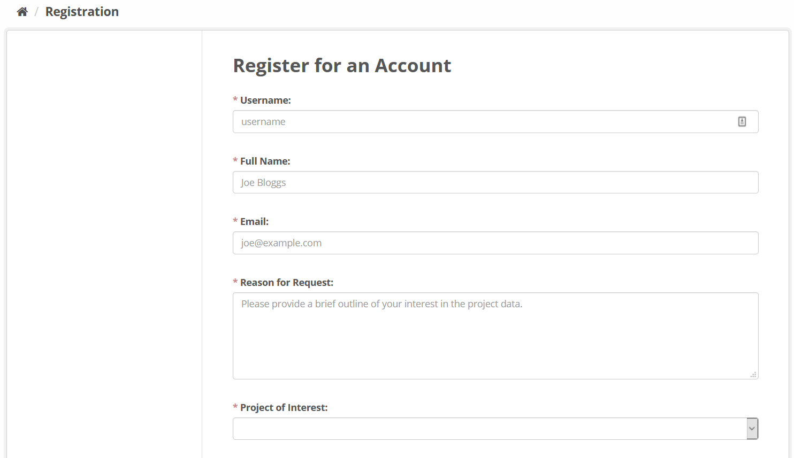

1. Go to the [Registration page](https://data.bioplatforms.com/user/register) and create an account

2. You will need the following information:

     - Username
     - Full name
     - Email
     - An outline of the reason for the request: e.g. I am part of the Oz Mammals Genomics consortium and would like to access raw data for the Fat-Tailed Dunnart project
     - Project of interest: e.g. Oz Mammals Genomics Initiative
     - Password: make sure that this conforms to the security requirements of the data portal

3. Once an account is created, the project manager for the selected project of interest will assess the request
4. Confirmation will be received via email
